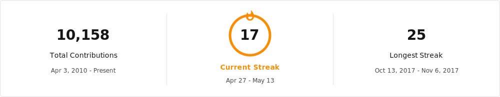

<!--  -->

<p align="center">
  
  
</p>
<p align="center">
  
</p>

<!--  -->

<!--START_SECTION:waka-->

```txt
From: 25 September 2017 - To: 11 May 2026

Total Time: 6,120 hrs 41 mins

Clojure                    1,632 hrs 51 mins     >>>>>>>------------------   26.68 %
Other                      921 hrs 16 mins       >>>>---------------------   15.05 %
Java                       857 hrs 5 mins        >>>>---------------------   14.00 %
Go                         776 hrs 41 mins       >>>----------------------   12.69 %
JavaScript                 489 hrs 4 mins        >>-----------------------   07.99 %
```

<!--END_SECTION:waka-->
