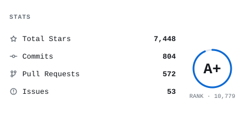
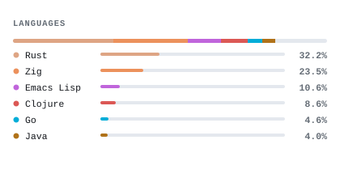
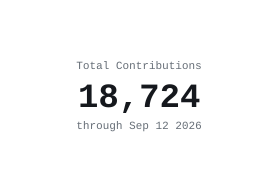
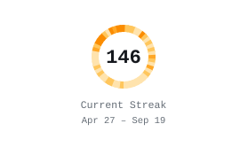
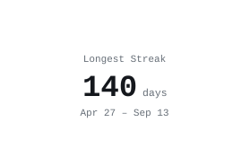

<p align="center">
  <picture><source media="(max-width: 768px) and (prefers-color-scheme: dark)" srcset="./profile/stats-narrow-dark.svg" /><source media="(max-width: 768px)" srcset="./profile/stats-narrow-light.svg" /><source media="(prefers-color-scheme: dark)" srcset="./profile/stats-dark.svg" /></picture>
  <picture><source media="(max-width: 768px) and (prefers-color-scheme: dark)" srcset="./profile/languages-narrow-dark.svg" /><source media="(max-width: 768px)" srcset="./profile/languages-narrow-light.svg" /><source media="(prefers-color-scheme: dark)" srcset="./profile/languages-dark.svg" /></picture>
</p>

<p align="center">
  <picture><source media="(prefers-color-scheme: dark)" srcset="./profile/total-dark.svg" /></picture>
  <picture><source media="(prefers-color-scheme: dark)" srcset="./profile/heat-dark.svg" /></picture>
  <picture><source media="(prefers-color-scheme: dark)" srcset="./profile/longest-dark.svg" /></picture>
</p>

<!--  -->

<!--START_SECTION:activity-->
```text
From: 26 July 2026 - To: 27 August 2026

LINES BY LANGUAGE

Total        +488,042   lines, 99.93% by an agent

Markdown     +127,034   #########################   26.02 %    99.96% agent   37 hrs 29 mins
Rust          +92,988   ##################-------   19.05 %    99.90% agent   34 hrs 20 mins
Go            +88,384   #################--------   18.10 %    99.99% agent   24 hrs 41 mins
Emacs Lisp    +41,193   ########-----------------    8.44 %    99.88% agent    7 hrs 23 mins
Zig           +31,158   ######-------------------    6.38 %   100.00% agent   12 hrs 34 mins
Python        +25,050   #####--------------------    5.13 %   100.00% agent    4 hrs 58 mins

# agent    = unattributed    - rest
```
<!--END_SECTION:activity-->
