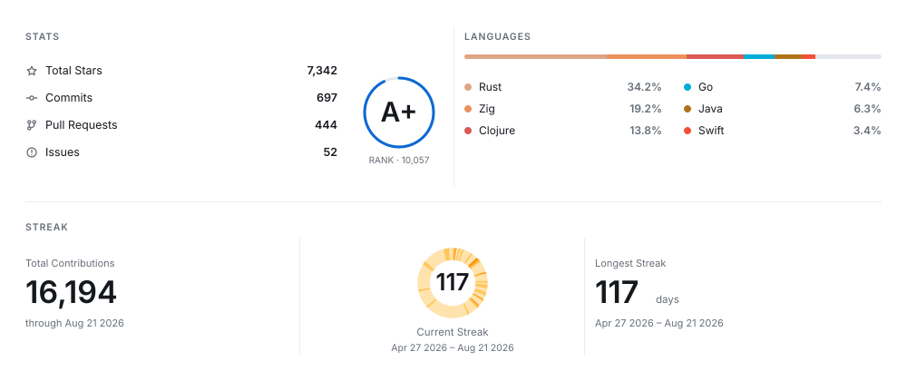

<p align="center">
  <picture>
    <source media="(prefers-color-scheme: dark)" srcset="./profile/github-personal-stats-dark.svg" />
    
  </picture>
</p>

<!--  -->

<!--START_SECTION:waka-->

```txt
From: 25 September 2017 - To: 20 August 2026

Total Time: 6,971 hrs 4 mins

Clojure                    1,639 hrs 12 mins     >>>>>>-------------------   23.51 %
Other                      943 hrs 3 mins        >>>----------------------   13.53 %
Go                         925 hrs 4 mins        >>>----------------------   13.27 %
Java                       860 hrs 45 mins       >>>----------------------   12.35 %
JavaScript                 490 hrs 57 mins       >>-----------------------   07.04 %
```

<!--END_SECTION:waka-->
