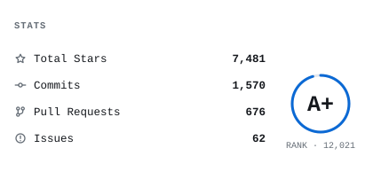
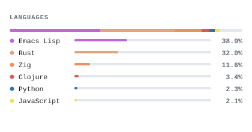
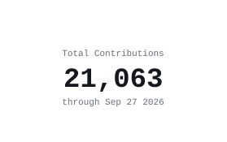
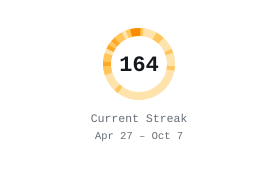
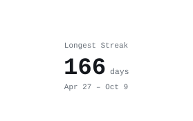

<p align="center">
  <picture><source media="(max-width: 768px) and (prefers-color-scheme: dark)" srcset="./profile/stats-narrow-dark.svg" /><source media="(max-width: 768px)" srcset="./profile/stats-narrow-light.svg" /><source media="(prefers-color-scheme: dark)" srcset="./profile/stats-dark.svg" /></picture>
  <picture><source media="(max-width: 768px) and (prefers-color-scheme: dark)" srcset="./profile/languages-narrow-dark.svg" /><source media="(max-width: 768px)" srcset="./profile/languages-narrow-light.svg" /><source media="(prefers-color-scheme: dark)" srcset="./profile/languages-dark.svg" /></picture>
</p>

<p align="center">
  <picture><source media="(prefers-color-scheme: dark)" srcset="./profile/total-dark.svg" /></picture>
  <picture><source media="(prefers-color-scheme: dark)" srcset="./profile/heat-dark.svg" /></picture>
  <picture><source media="(prefers-color-scheme: dark)" srcset="./profile/longest-dark.svg" /></picture>
</p>

<!--  -->

<!--START_SECTION:activity-->
```text
From: 26 July 2026 - To: 3 October 2026

LINES BY LANGUAGE

Total        +52,378   lines, 100.00% by an agent

Markdown     +12,212   #########################   23.31 %   100.00% agent   1 hrs 59 mins
Go           +10,330   #####################----   19.72 %   100.00% agent   0 hrs 58 mins
Emacs Lisp    +7,804   ################---------   14.89 %   100.00% agent   1 hrs  8 mins
Swift         +6,816   ##############-----------   13.01 %   100.00% agent   1 hrs 34 mins
Rust          +3,284   #######------------------    6.26 %   100.00% agent   0 hrs 22 mins
Python        +2,930   ######-------------------    5.59 %   100.00% agent   0 hrs 18 mins

# agent    = unattributed    - rest
```
<!--END_SECTION:activity-->
